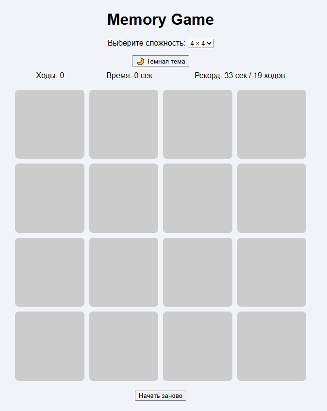
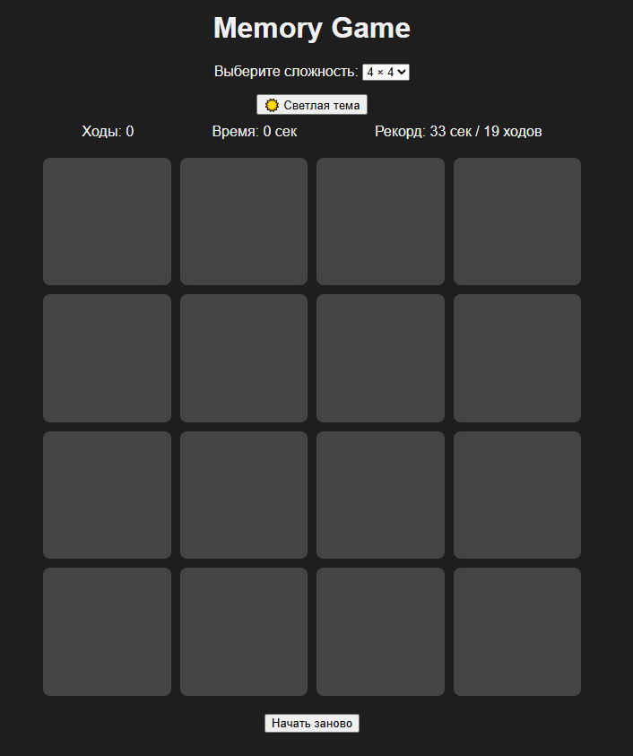
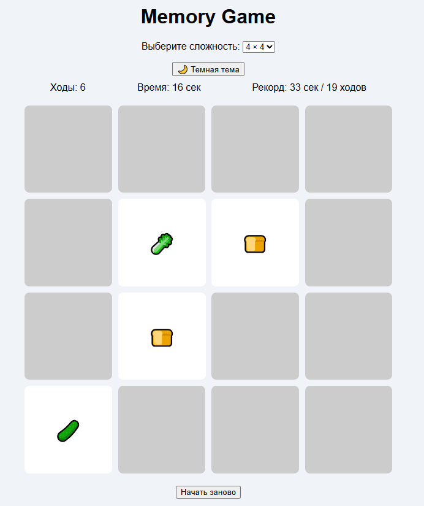
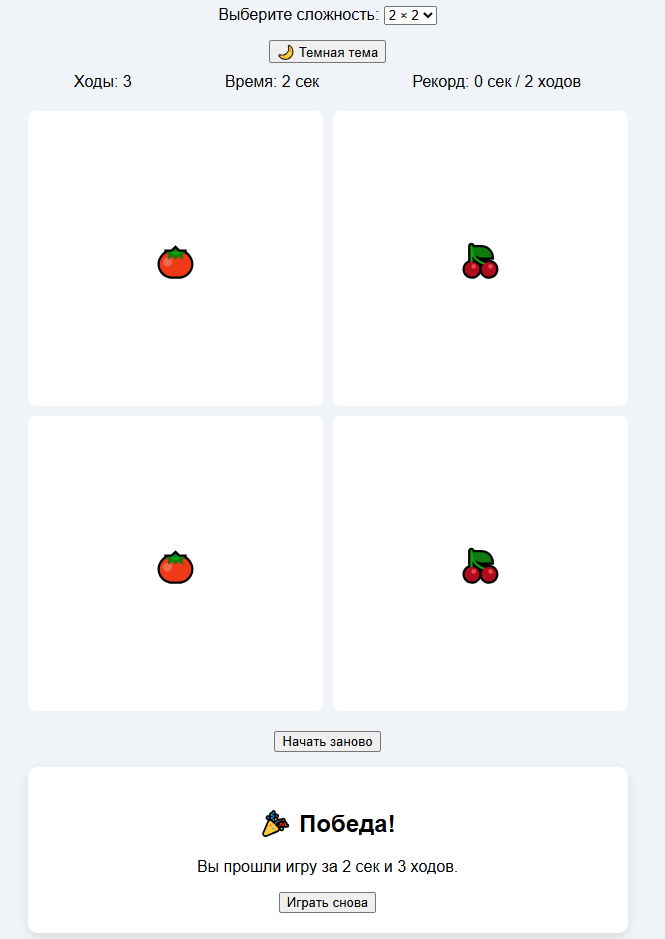

# Memory Game

Игра "Найди пары", реализованная на чистом **HTML**, **CSS** и **JavaScript**.

## Оглавление

- [Особенности](#особенности)
- [Структура проекта](#структура-проекта)
- [Запуск](#как-запустить)
- [Скриншоты](#скриншоты)
- [Автор](#автор)


## Особенности

- Выбор сложности: от 2×2 до 8×8
- Подсчет ходов и времени
- Сохраняется лучший результат (localStorage)
- Темная и светлая тема
- Адаптивный дизайн

## Структура проекта

- screens - Папка со скриншотами
- index.html - Основная HTML-страница
- styles.css - Стилизация калькулятора
- script.js - Логика и обработка ввода
- README.md - Документация проекта

## Как запустить

1. Скачайте или клонируйте репозиторий:

   ```
   git clone https://github.com/Ars2805/memory-game.git
   ```

2. Откройте файл index.html в браузере.

## Скриншоты






## Автор

- [Арсения Лушина](https://github.com/Ars2805)